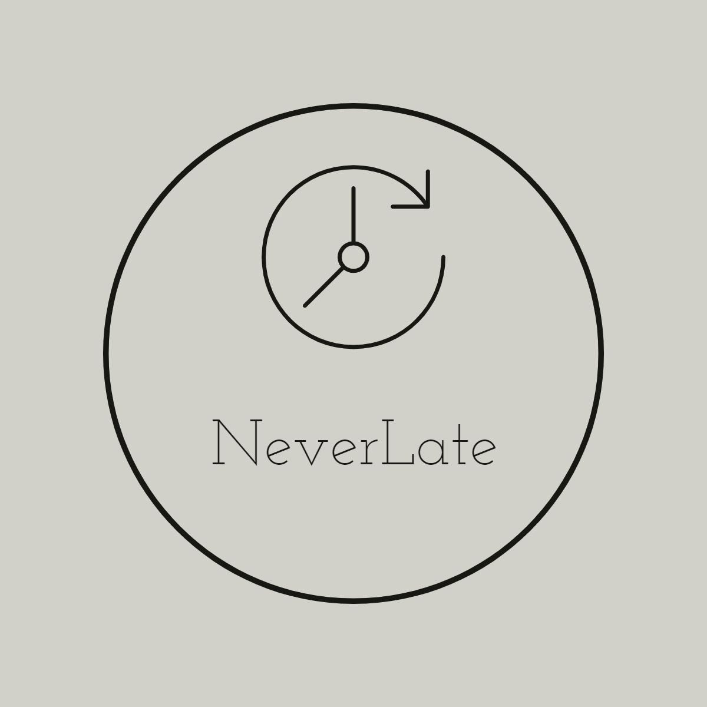

# NeverLate

<<<<<<< HEAD

=======

>>>>>>> cbaaac3e113254561561d970428ea06645ae0dae

# Description

description of the app

# Team

- Tenzin Tashi
- Valeryia Pilchuk
- Michali
- Anil B
- Yang
- Alice

# Technologies Used

- React JS
- Node JS
- Express
- Mongo DB
- Python
- AWS Cognito

<<<<<<< HEAD
<<<<<<< HEAD
=======
# Live Demo
<a href="http://204.48.22.15/">http://204.48.22.15/</a>

>>>>>>> cbaaac3e113254561561d970428ea06645ae0dae
=======
>>>>>>> parent of 52a473d (Update README.md)
# How to install/run it?

### Pre-requisite: Software needed to run the project

- NodeJS Installed (<a href="https://nodejs.org/en/download/">Click here to install nodejs</a>)
- NPM Installed (<a href="https://docs.npmjs.com/downloading-and-installing-node-js-and-npm">How to install NPM </a>)
- Code editor of your choice (recommended VSCode <a href="https://code.visualstudio.com">Download</a>)

### First clone the project from the github

- Open terminal
- Go to the location where you want to clone the project
- Run the command

```
git clone https://github.com/ValeryiaPilchuk/Never_Late.git
```

- Then go the project folder

```
cd neverlate
```

<<<<<<< HEAD
- Install the needed dependencies

```
npm install
```

### `Run the frontend of the project`

```
npm start
```

This will start the frontend of the project in the development mode.<br>
Open [http://localhost:3000](http://localhost:3000) to view it in the browser.

### `Run the backend of the project`

```
cd server
=======
### `Run the backend of the project`

```
node server.js
```

This will start the backend of the project in the development mode.<br>
Open [http://localhost:5000](http://localhost:5000) to view it in the browser.

### `Run the frontend of the project`

- Change to client folder

```
cd client
```

- Install the needed dependencies

```
npm install
```

- Run the client server

```
>>>>>>> cbaaac3e113254561561d970428ea06645ae0dae
npm start
```

This will start the project in the development mode.<br>
<<<<<<< HEAD
Open [http://localhost:8000](http://localhost:8000) to view it in the browser.
=======
Open [http://localhost:3000](http://localhost:3000) to view it in the browser.
>>>>>>> cbaaac3e113254561561d970428ea06645ae0dae
